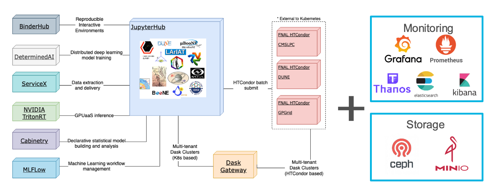
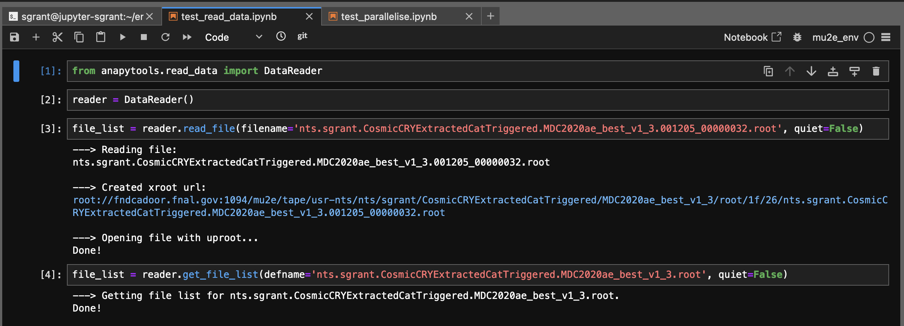

# Fermilab Elastic Analysis Facility (EAF) Guide

This guide is intended for Mu2e collaborators using the Fermilab Elastic Analysis Facility (EAF). For official EAF documentation from SCD, visit [test-1-eaf.fnal.gov](https://test-1-eaf.fnal.gov).

## Overview

EAF is a web-based platform designed for Python analysis and ML tasks. It utilises container-based infrastructure, distinguishing it from traditional virtual machines. This approach allows underlying hardware resources to be swapped without breaking the container, providing greater elasticity.



## Accessing EAF

EAF is entirely web-based at [analytics-hub.fnal.gov](https://analytics-hub.fnal.gov). To access EAF from outside the FNAL network, you will need either:
- A Fermilab VPN connection
- A configured proxy
- An active services account

### Setting Up Firefox Proxy (SCD Recommended Method)

1. Ensure you have a valid kerberos ticket:
   ```bash
   klist  # Check ticket
   kinit <username>@FNAL.GOV  # Create new ticket
   ```

2. Start an SSH tunnel:
   ```bash
   ssh -f -N -D 9999 <username>@mu2egpvm01.fnal.gov
   ```

3. Configure Firefox:
   - Enter `about:config` in the address bar
   - Modify the following parameters:

   | Parameter | Value |
   |-----------|-------|
   | network.proxy.socks | 127.0.0.1 |
   | network.proxy.socks_port | 9999 |
   | network.proxy.socks_remote_dns | true |
   | network.proxy.type | 1 |

To disable the proxy, reset `network.proxy.type` to its default value.

For more information, visit [Off-site Electronic Access Instructions](https://library.fnal.gov/off-site-electronic-access-instructions).

## Starting an EAF Server

1. Navigate to [analytics-hub.fnal.gov](https://analytics-hub.fnal.gov)
2. Sign in with your Fermilab Services (SSO) account
3. Click "Start My Server"
4. In the Server Options:
   - Go to the "FIFE" server box
   - Click "CPU Interactives"
   - Select "AL9"
   - Scroll to bottom and click "Start"

The server may take a few minutes to initialise.

## JupyterHub Environment

Upon loading, you'll land on a JupyterHub launcher page offering various applications:
- Terminal
- Python notebook
- Python file editor
- Interactive Python console


Your user area will be automatically created in `/home` with access to:
- `/exp/mu2e/app`
- `/exp/mu2e/data`
- `/pnfs` (requires `xroot`, included in `mu2e_env`)

Resource limits per user:
- 8 guaranteed cores
- 64 GB memory
- 23 GB storage

## Conda/Mamba Setup

Mamba is used for package and environment management. To initialise:

1. Configure `.bash_profile`:
   ```bash
   # Add to ~/.bash_profile
   if [ -f ~/.bashrc ]; then
       . ~/.bashrc
   fi
   ```

2. Initialise Mamba:
   ```bash
   mamba init
   ```
   Start a new shell after initialisation.

## Mu2e Environment

The Mu2e environment provides necessary analysis tools. To set up:

1. Create environment symlink:
   ```bash
   ln -s /cvmfs/mu2e.opensciencegrid.org/env/ana/current ~/.conda/envs/mu2e_env
   ```

2. Activate environment:
   ```bash
   mamba activate mu2e_env
   ```

### Available Libraries

- matplotlib
- pandas
- uproot
- scipy
- scikit-learn
- pytorch
- tensorflow
- jupyterlab
- notebook
- statsmodels
- awkward
- urllib3 (v1.26.16)
- ipykernel
- conda-pack
- fsspec-xrootd
- htop
- vector
- plotly
- dash
- anapytools (v2.0.0)

### Using with Virtual Machines

To use on Mu2e virtual machines:

```bash
# Activate
source /cvmfs/mu2e.opensciencegrid.org/env/ana/current/bin/activate

# Deactivate
source /cvmfs/mu2e.opensciencegrid.org/env/ana/current/bin/deactivate
```

Suggested aliases for `.my_bashrc`:
```bash
alias pystart="source /cvmfs/mu2e.opensciencegrid.org/env/ana/current/bin/activate"
alias pystop="source /cvmfs/mu2e.opensciencegrid.org/env/ana/current/bin/deactivate"
```

When using with `muse`:
```bash
mu2einit
muse setup ops
pystart  # or source /cvmfs/mu2e.opensciencegrid.org/env/ana/current/bin/activate
```

## Custom Environments

To create a new environment from scratch:
```bash
mamba create -q -y -n my_env
mamba activate my_env
```

Install packages using: `mamba install <package_name>`

## anapytools

The `mu2e_env` includes utilities from [anapytools](https://github.com/Mu2e/anapytools.git) for interfacing with `SAM` and `/pnfs`.

Setup:
```bash
source /cvmfs/mu2e.opensciencegrid.org/setupmu2e-art.sh
kinit ${USER}@FNAL.GOV
/cvmfs/mu2e.opensciencegrid.org/bin/vomsCert
```

Example usage:
```python
# Create file list from SAM dataset
from anapytools.read_data import DataReader
reader = DataReader()
file_list = reader.get_file_list(defname='nts.mu2e.CeEndpointMix1BBSignal.Tutorial_2024_03.tka')

# Read file from /pnfs using xroot
file = reader.read_file(filename='nts.sgrant.CosmicCRYExtractedCatTriggered.MDC2020ae_best_v1_3.001205_00000000.root')

# Parallel processing
from anapytools.parallelise import ParallelProcessor
processor = ParallelProcessor()

def process_function(filename):
    file = reader.read_file(filename, quiet=True)
    return

processor.multithread(process_function, file_list)
```

Example of reading data:


Example of parallel processing:
